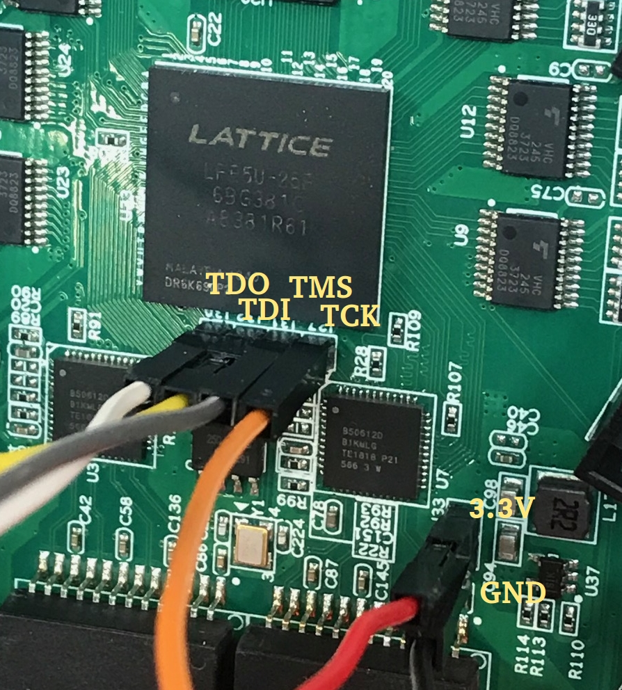
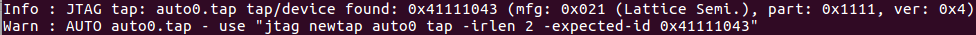

# Colorlight 5A-75B

The Colorlight 5A-75B is an evolution of the RV901T with 8 HUB75 ports that
uses a Lattice ECP5-25 chip: the LFE5U-25F with CABGA381 package to be precise.

This makes the board extremely interesting because it's supported by the Yosys and NextPnR
open-source backend flows.

The board has the following components:

* LFE5U-25F FPGA
* 1 25Q16 serial PROM for FPGA configuration
* 2 1M x 16bit SDRAMs (on my board, they're EtronTech EM636165-6G 166MHz)
* 2 1Gb Ethernet PHYs (Boardcom B50612D, just like the RV901T)
* Tons of level shifters to translate from 3.3V to 5V signaling

The board has 1 unpopulated 4-pin connector with the JTAG signals and 1 unpopulated 2-pin connector with
GND and the 3.3V. This makes it extremely easy to connect a JTAG programmer to the board!

