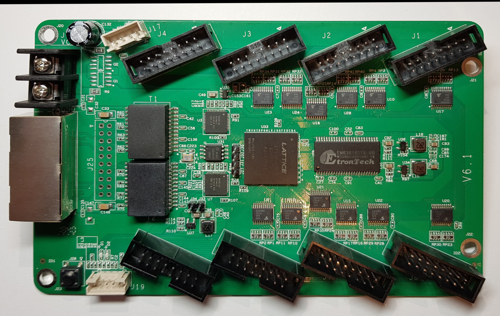
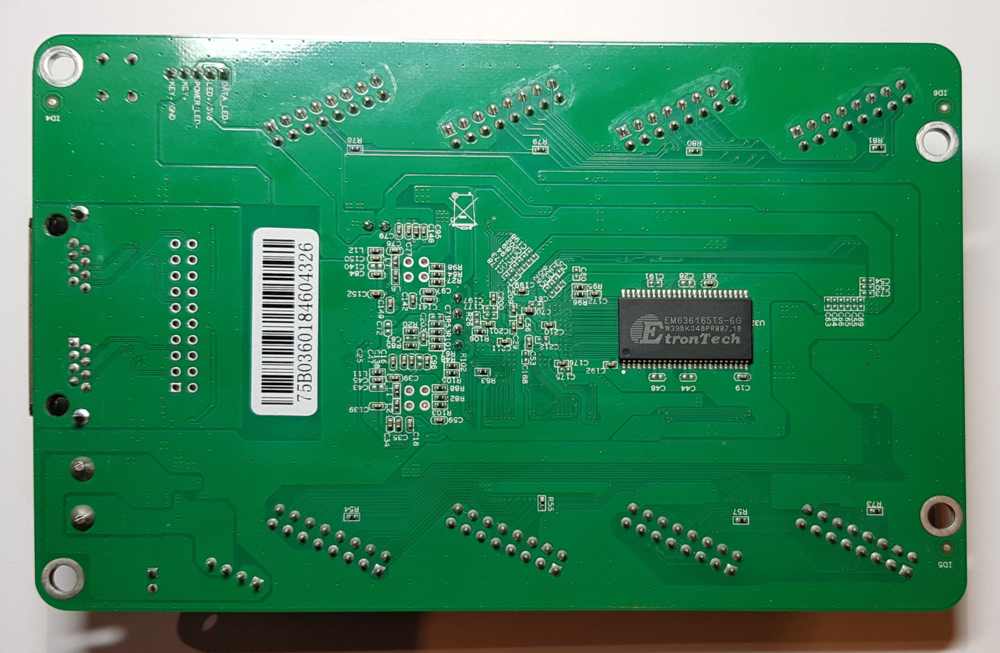

# Colorlight 5A-75B V6.1 Hardware

## Components

* Lattice ECP5 `LFE5U-25F-6BG381C` ([product page](https://www.latticesemi.com/Products/FPGAandCPLD/ECP5))
* GigaDevice `GD25Q16CSIG`, 16 Mbits SPI flash ([datasheet](datasheets/gd25q16c_v3.0_20181204.pdf))
* 2x Broadcom `B50612D` Gigabit Ethernet PHYs ([datasheet](datasheets/B50610-DS07-RDS.pdf))
* 2x EtronTech `EM636165-6G` 1M x 16bit 166MHz SDRAMs (organized as 1M x 32bit) ([datasheet](datasheets/EM636165_34.pdf))
* 12x `TC74VHC245` Octal Bidirectional Transceiver (used for level translation to 5V) ([datasheet](datasheets/TC74VHCV245FK_datasheet_en_20190131.pdf))

## PCB overview

## FPGA connections

### JTAG

JTAG is available on a 4-pin header next to the FPGA (U33). VCC/GND are available on a 2-pin header nearby.

| Pin | Function |
|-----|----------|
| J27 | TCK      |
| J31 | TMS      |
| J32 | TDI      |
| J30 | TDO      |
|     |          |
| J33 | *3.3V*   |
| J34 | *GND*    |

### LED / Button

The board has a FPGA controlled LED and a button, those signals are also accessible on the J19 connector

| Pin | Function   | Note |
|-----|------------|------|
| U16 | LED D2     | Active low
| R16 | Button J28 | Active low, pulled up with 10k

### SPI Flash (U31)

| Flash Pin | FPGA Pin | Function | Notes |
|-----------|----------|----------|-------|
| 1         | R2       | CS#      |
| 2         | V2       | SO       |
| 3         | _na_     | WP#      | Wired to 3v3
| 4         | _na_     | GND      |
| 5         | W2       | SI       |
| 6         | U3       | SCK      |
| 7         | _na_     | Hold#    | Wired to 3v3
| 8         | _na_     | VCC      | Wired to 3v3

### SDRAM (U29 & U32)

The two SDRAMs are configured as 1M x32 with the address and control signals shared and the data signals independently routed to the FPGA.

| SDRAM Signal | FPGA Pin for U29 | FPGA Pin for U32 | Notes |
|--------------|------------------|------------------|-------|
| DQ[0]        | D15              | D5               |
| DQ[1]        | E14              | C5               |
| DQ[2]        | E13              | D6               |
| DQ[3]        | D12              | C6               |
| DQ[4]        | E12              | E7               |
| DQ[5]        | D11              | D7               |
| DQ[6]        | C10              | E8               |
| DQ[7]        | B17              | D8               |
| DQ[8]        | B8               | E9               |
| DQ[9]        | A8               | D9               |
| DQ[10]       | C7               | E11              |
| DQ[11]       | A7               | C11              |
| DQ[12]       | A6               | C12              |
| DQ[13]       | B6               | D13              |
| DQ[14]       | A5               | D14              |
| DQ[15]       | B5               | C15              |
| A[0]         | B13              | B13              |
| A[1]         | C14              | C14              |
| A[2]         | A16              | A16              |
| A[3]         | A17              | A17              |
| A[4]         | B16              | B16              |
| A[5]         | B15              | B15              |
| A[6]         | A14              | A14              |
| A[7]         | A13              | A13              |
| A[8]         | A12              | A12              |
| A[9]         | A11              | A11              |
| A[10]        | B12              | B12              |
| A[11]        | B11              | B11              |
| LDQM         | _na_             | _na_             | Wired to GND
| UDQM         | _na_             | _na_             | Wired to GND
| WE#          | A10              | A10              |
| CAS#         | A9               | A9               |
| RAS#         | B10              | B10              |
| CS#          | _na_             | _na_             | Wired to GND
| CKE          | _na_             | _na_             | Wired to 3v3
| CLK          | B9               | B9               |

### Gigabit PHYs (U3 & U7)

| PHY Signal | FPGA Pin for U3 | FPGA Pin for U7 | Notes |
|------------|-----------------|-----------------|-------|
| MDC        | N5              | N5
| MDIO       | P5              | P5
| Reset#     | P4              | P4
| PHYA[0]    | _wired to GND_  | _wired to 3v3_  | Fixes each PHY to different address
| XTALO      | P3              | _na_            | Provides a 25 MHz clock to the FPGA
|            |                 |
| GTXCLK     | G1              | U19
| TXD[0]     | G2              | U20
| TXD[1]     | H1              | T19
| TXD[2]     | J1              | T20
| TXD[3]     | J3              | R20
| TX\_EN     | K1              | P19
|            |                 |
| RXC        | H2              | L19
| RXD[0]     | K2              | P20
| RXD[1]     | L1              | N19
| RXD[2]     | N1              | N20
| RXD[3]     | P1              | M19
| RX\_DV     | P2              | M20

### HUB75 headers

#### J1

| HUB75 Pin | HUB75 Signal | FPGA Pin | Buffer chip / bit |
|-----------|--------------|----------|-------------------|
| 1         | R0           | B3       | U28.7
| 2         | G0           | A2       | U28.6
| 3         | B0           | B2       | U28.5
| 5         | R1           | B1       | U28.4
| 6         | G1           | C2       | U28.2
| 7         | B1           | C1       | U28.3
|           |              |          |
| 9         | A            | F1       | U10.2
| 10        | B            | E2       | U10.4
| 11        | C            | E1       | U10.6
| 12        | D            | F2       | U10.0
| 8         | E            | J17      | U17.2
|           |              |          |
| 13        | Clock        | C18      | U17.4
| 14        | Latch        | J18      | U17.0
| 15        | Blank        | H16      | U17.6

#### J2

| HUB75 Pin | HUB75 Signal | FPGA Pin | Buffer chip / bit |
|-----------|--------------|----------|-------------------|
| 1         | R0           | D2       | U28.1
| 2         | G0           | H3       | U28.0
| 3         | B0           | H4       | U24.7
| 5         | R1           | J4       | U24.6
| 6         | G1           | B4       | U24.5
| 7         | B1           | A3       | U24.4
|           |              |          |
| 9         | A            | F1       | U10.2
| 10        | B            | E2       | U10.4
| 11        | C            | E1       | U10.6
| 12        | D            | F2       | U10.0
| 8         | E            | J17      | U17.2
|           |              |          |
| 13        | Clock        | C18      | U16.4
| 14        | Latch        | J18      | U16.0
| 15        | Blank        | H16      | U16.6

#### J3

| HUB75 Pin | HUB75 Signal | FPGA Pin | Buffer chip / bit |
|-----------|--------------|----------|-------------------|
| 1         | R0           | D1       | U24.3
| 2         | G0           | J5       | U24.2
| 3         | B0           | K4       | U24.1
| 5         | R1           | K5       | U24.0
| 6         | G1           | K3       | U23.7
| 7         | B1           | E5       | U23.6
|           |              |          |
| 9         | A            | F1       | U10.3
| 10        | B            | E2       | U10.5
| 11        | C            | E1       | U10.7
| 12        | D            | F2       | U10.1
| 8         | E            | J17      | U17.3
|           |              |          |
| 13        | Clock        | C18      | U16.5
| 14        | Latch        | J18      | U16.1
| 15        | Blank        | H16      | U16.7

#### J4

| HUB75 Pin | HUB75 Signal | FPGA Pin | Buffer chip / bit |
|-----------|--------------|----------|-------------------|
| 1         | R0           | N3       | U23.5
| 2         | G0           | N4       | U23.4
| 3         | B0           | R3       | U23.3
| 5         | R1           | T3       | U23.2
| 6         | G1           | R1       | U23.1
| 7         | B1           | T1       | U23.0
|           |              |          |
| 9         | A            | F1       | U10.3
| 10        | B            | E2       | U10.5
| 11        | C            | E1       | U10.7
| 12        | D            | F2       | U10.1
| 8         | E            | J17      | U17.3
|           |              |          |
| 13        | Clock        | C18      | U17.5
| 14        | Latch        | J18      | U17.1
| 15        | Blank        | H16      | U17.7

#### J5

| HUB75 Pin | HUB75 Signal | FPGA Pin | Buffer chip / bit |
|-----------|--------------|----------|-------------------|
| 1         | R0           | U17      | U9.6
| 2         | G0           | U18      | U9.7
| 3         | B0           | T17      | U9.5
| 5         | R1           | T18      | U9.3
| 6         | G1           | K20      | U9.4
| 7         | B1           | L20      | U9.2
|           |              |          |
| 9         | A            | F1       | U22.0
| 10        | B            | E2       | U22.6
| 11        | C            | E1       | U22.4
| 12        | D            | F2       | U22.2
| 8         | E            | J17      | U20.2
|           |              |          |
| 13        | Clock        | C18      | U20.0
| 14        | Latch        | J18      | U20.4
| 15        | Blank        | H16      | U20.6

#### J6

| HUB75 Pin | HUB75 Signal | FPGA Pin | Buffer chip / bit |
|-----------|--------------|----------|-------------------|
| 1         | R0           | J20      | U9.0
| 2         | G0           | K19      | U9.1
| 3         | B0           | J19      | U12.7
| 5         | R1           | G20      | U12.5
| 6         | G1           | H20      | U12.6
| 7         | B1           | G19      | U12.4
|           |              |          |
| 9         | A            | F1       | U22.0
| 10        | B            | E2       | U22.6
| 11        | C            | E1       | U22.4
| 12        | D            | F2       | U22.2
| 8         | E            | J17      | U20.2
|           |              |          |
| 13        | Clock        | C18      | U21.0
| 14        | Latch        | J18      | U21.4
| 15        | Blank        | H16      | U21.6

#### J7

| HUB75 Pin | HUB75 Signal | FPGA Pin | Buffer chip / bit |
|-----------|--------------|----------|-------------------|
| 1         | R0           | F19      | U12.2
| 2         | G0           | F20      | U12.3
| 3         | B0           | E20      | U12.1
| 5         | R1           | D20      | U15.7
| 6         | G1           | E19      | U12.0
| 7         | B1           | D19      | U15.6
|           |              |          |
| 9         | A            | F1       | U22.1
| 10        | B            | E2       | U22.7
| 11        | C            | E1       | U22.5
| 12        | D            | F2       | U22.3
| 8         | E            | J17      | U20.3
|           |              |          |
| 13        | Clock        | C18      | U21.1
| 14        | Latch        | J18      | U21.5
| 15        | Blank        | H16      | U21.7

#### J8

| HUB75 Pin | HUB75 Signal | FPGA Pin | Buffer chip / bit |
|-----------|--------------|----------|-------------------|
| 1         | R0           | B20      | U15.4
| 2         | G0           | C20      | U15.5
| 3         | B0           | B19      | U15.3
| 5         | R1           | B18      | U15.1
| 6         | G1           | A19      | U15.2
| 7         | B1           | A18      | U15.0
|           |              |          |
| 9         | A            | F1       | U22.1
| 10        | B            | E2       | U22.7
| 11        | C            | E1       | U22.5
| 12        | D            | F2       | U22.3
| 8         | E            | J17      | U20.3
|           |              |          |
| 13        | Clock        | C18      | U20.1
| 14        | Latch        | J18      | U20.5
| 15        | Blank        | H16      | U20.7

## Buffering architecture

The buffers are powered directly from the raw input voltage (nominal 5V) and translate between the FPGA 3v3 to the voltage required for the panels.

### Address lines

Line all control signals, the address lines `A`, `B`, `C`, `D` all share a single FPGA pin. That signal is then buffered several times in parallel with each buffer output going through a 33R and then to two adjacent HUB75 connectors.

The address line `E` is a bit special and there are additional 22R resistors in series with the connection to each pin. this is most likely to deal with the fact that the `E` line is a re-used `GND` pin and so some panels might short it to `GND`.

### Misc control lines

The control lines `CLK`, `LATCH`, `BLANK` also share a single FPGA pin but each connector has its own buffer and inline 33R resistor.

### Data lines

Those are the simplest, all independent, one buffer per data bit with a 33R in series.

