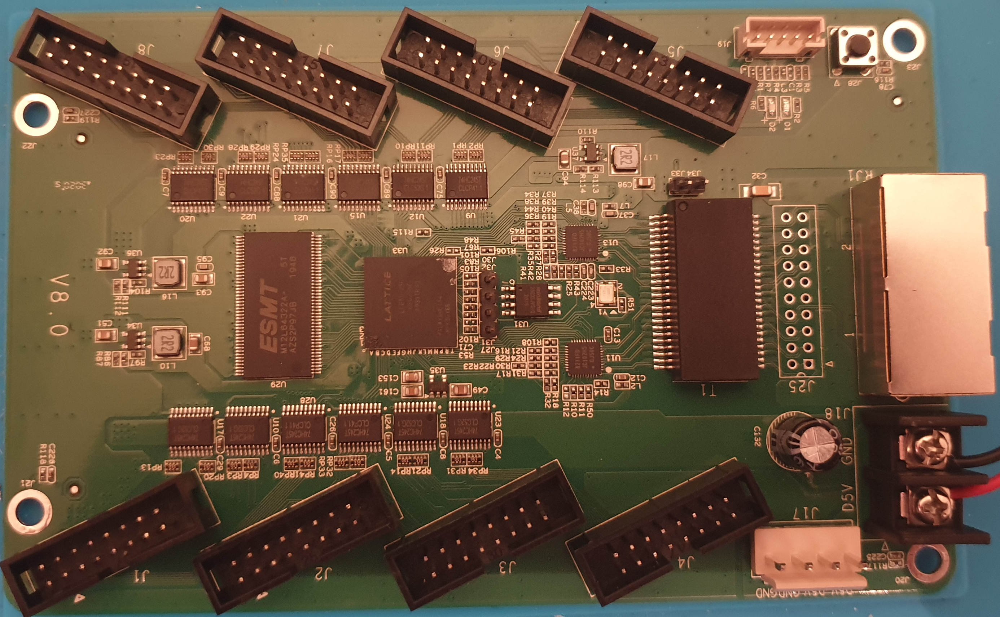
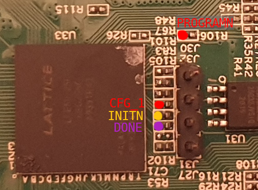

Colorlight 5A-75B V8.0 Hardware
===============================

Components
----------

* Lattice ECP5 `LFE5U-25F-6BG256C` ([product page](https://www.latticesemi.com/Products/FPGAandCPLD/ECP5))
* Winbond `25Q32JVSIQ`, 32 Mbits SPI flash ([datasheet](datasheets/w25q32jv_spi_revc_08302016.pdf))
* 2x Realtek `RTL8211FD` Gigabit Ethernet PHYs ([datasheet](datasheets/RTL8211F-CG-RealtekMicroelectronics.pdf))
* 1x ESMT `M12L64322A` 2M 200MHz SDRAM (organized as 4 x 512k x 32bit) ([datasheet](datasheets/M12L64322A(2S).pdf))
* 12x `74HC245T` Octal Bidirectional Transceiver (used for level translation to 5V)

PCB overview
------------

Definitions
-----------

Power
-----
The maximum voltage at the 5V input is 5.5V, due to the buck converters used.
The 5V rail directly feeds only the FPGA power supplies and the 74HC245T output level shifters.
FPGA power is supplied by 3 buck converters. They are compatible with a TI TLV62565/6 in a SOT23-5 package.

| Buck converter | Vout | Rail | Description               |
|----------------|------|------|---------------------------|
| U34            |1.1V  | Vcc  | Core supply voltage       |
| U37            |1.0V  | Vref | Reference voltage         |
| U38            |3.3V  | Vccio| I/O Driver supply voltage and 3.3V for the rest of the board |

JTAG
----

JTAG is available on a 4-pin header next to the FPGA (U33). VCC/GND are available on a 2-pin header nearby.

| Pin | Function |
|-----|----------|
| J27 | TCK      |
| J31 | TMS      |
| J32 | TDI      |
| J30 | TDO      |
|     |          |
| J33 | *3.3V*   |
| J34 | *GND*    |

FPGA configuration controls
---------------------------

ECP5 sysCONFIG signals are "broken out" to resistors near the FPGA and the JTAG
connector, like so:

| Resistor | Signal   | Pin |
|----------|----------|-----|
| R106     | PROGRAMN | R9  |
| R83      | CFG_1    | P10 |
| R105     | INITN    | T9  |
| R102     | DONE     | P9  |

All these signals are pulled up by their respective resistors to the 3v3 rail.

SPI Flash (U31)
---------------

| Flash Pin | FPGA Pin | Function | Notes |
|-----------|----------|----------|-------|
| 1         | N8       | CS#      |
| 2         | T7       | SO       |
| 3         | _na_     | WP#      | Wired to 3v3
| 4         | _na_     | GND      |
| 5         | T8       | SI       |
| 6         | N9       | SCK      | CCLK/MCLK pin, through sysCONFIG USRMCLK primitive (with USRMCLKTS=0)
| 7         | _na_     | Hold#    | Wired to 3v3
| 8         | _na_     | VCC      | Wired to 3v3

Connections
===========

Clock
-----

A 25 MHz clock is generated by phy1 (U13) and distributed to phy0 (U11) and FPGA (U33) pin P6.
NOTE: Do not reset the phy(s) if your gateware depend on clock on pin P6

LED, Button
-----------

There is a general purpose, FPGA controlled LED (DATA_LED-) at T6, active low (FPGA pin should be set to open drain).

Additionally, there is a button (R7, KEY+).

Pad N16 is connected to R26 (unpopulated).

On the bottom side of the PCB, one can find resistors R107 and R109. These are connected to FPGA pads D12 and A12, respectively.

SDRAM U29
---------

The SDRAM is organized as 2Mx32.

| SDRAM Signal | FPGA Pin for U29 | Notes |
|--------------|------------------|-------|
| DQ0          | B2               |
| DQ1          | A2               |
| DQ2          | C3               |
| DQ3          | A3               |
| DQ4          | B3               |
| DQ5          | A4               |
| DQ6          | B4               |
| DQ7          | A5               |
| DQ8          | E7               |
| DQ9          | C6               |
| DQ10         | D7               |
| DQ11         | D6               |
| DQ12         | E6               |
| DQ13         | D5               |
| DQ14         | C5               |
| DQ15         | E5               |
| DQ16         | A11              |
| DQ17         | B11              |
| DQ18         | B12              |
| DQ19         | A13              |
| DQ20         | B13              |
| DQ21         | A14              |
| DQ22         | B14              |
| DQ23         | D14              |
| DQ24         | D13              |
| DQ25         | E11              |
| DQ26         | C13              |
| DQ27         | D11              |
| DQ28         | C12              |
| DQ29         | E10              |
| DQ30         | C11              |
| DQ31         | D10              |
| BA0          | B7               |
| BA1          | A8               |
| A0           | A9               |
| A1           | B9               |
| A2           | B10              |
| A3           | C10              |
| A4           | D9               |
| A5           | C9               |
| A6           | E9               |
| A7           | D8               |
| A8           | E8               |
| A9           | C7               |
| A10/AP       | B8               |
| DQM0         | _na_             | Wired to GND
| DQM1         | _na_             | Wired to GND
| DQM2         | _na_             | Wired to GND
| DQM3         | _na_             | Wired to GND
| WE#          | B5               |
| CAS#         | A6               |
| RAS#         | B6               |
| CS#          | _na_             | Wired to GND
| NC           | A7               |
| CKE          | _na_             | Wired to 3.3V
| CLK          | C8               |

Gigabit PHYs (U11 & U13)
------------------------

PHYRstB, MDC and MDIO are shared between phy0 and phy1.

| PHY Signal | FPGA Pin for U11 | FPGA Pin for U13 | Notes |
|------------|------------------|------------------|-------|
| PHYRstB    | R6               | R6               |
| MDC        | R5               | R5               |
| MDIO       | T4               | T4               |
| TXD3       | R1               | K15              |
| TXD2       | P1               | J14              |
| TXD1       | M1               | J15              |
| TXD0       | M2               | K16              |
| TXCTL      | L2               | K14              |
| TXC        | L1               | J16              |
| RXD3       | K3               | L16              | PhyAddr0
| RXD2       | K1               | L15              | PllOff
| RXD1       | J3               | R16              | TXDly
| RXD0       | K2               | M15              | RXDly
| RXCTL      | J2               | P16              | PhyAddr1
| RXC        | J1               | M16              | PhyAddr2
| INTB       | _na_             | _na_             |

HUB75 headers
-------------

It is possible to replace the 74HC245T output drivers with pin-compatible SN74CBT3245A octal fet bus switches to allow for bidirectional I/O. Note that the output drivers are powered from 5V, so the only protection when using 5V I/O are the resistor packs. ECP5 FPGA does not have 5V tolerant I/O.

Connector J1
--------------

| J1 Pin| HUB75 pin | FPGA Pin | FPGA Bank - Pin Functions         | Buffer  | Notes           |
|-------|-----------|----------|-----------------------------------|---------|-----------------|
| 1     | R0        |  C4      |                                   |         |                 |
| 2     | G0        |  D4      |                                   |         |                 |
| 3     | B0        |  E4      |                                   |         |                 |
| 4     | *GND*     |  *GND*   | -                                 | *GND*   |                 |
| 5     | R1        |  D3      |                                   |         |                 |
| 6     | G1        |  F5      |                                   |         |                 |
| 7     | B1        |  E3      | Bank 3 - PR47D - *LRC_GPLL0C_IN*  |         |                 |
| 8     | E         |  N4      |                                   |         |                 |
| 9     | A         |  N5      | Bank 6 - *PL44D*                  |         |                 |
| 10    | B         |  N3      | Bank 6 - PL35D                    |         |                 |
| 11    | C         |  P3      | Bank 6 - *PL38B*                  |         |                 |
| 12    | D         |  P4      | Bank 6 - PL41A                    |         |                 |
| 13    | CLK       |  M3      | Bank 6 - PL32D                    |         |                 |
| 14    | STB       |  N1      | Bank 6 - PL32A                    |         |                 |
| 15    | OE        |  M4      | Bank 6 - PL35C                    |         |                 |
| 16    | *GND*     |  *GND*   | -                                 | *GND*   |                 |

Connector J2
--------------

| J2 Pin| HUB75 pin | FPGA Pin | FPGA Bank - Pin Functions     | Buffer  | Notes           |
|-------|-----------|----------|-------------------------------|---------|-----------------|
| 1     | R0        |  F1      |                               |         |                 |
| 2     | G0        |  F2      |                               |         |                 |
| 3     | B0        |  G2      |                               |         |                 |
| 4     | *GND*     |  *GND*   | -                             | *GND*   |                 |
| 5     | R1        |  G1      |                               |         |                 |
| 6     | G1        |  H2      |                               |         |                 |
| 7     | B1        |  H3      |                               |         |                 |
| 8     | E         |  N4      |                               |         |                 |
| 9     | A         |  N5      | Bank 6 - *PL44D*              |         |                 |
| 10    | B         |  N3      | Bank 6 - PL35D                |         |                 |
| 11    | C         |  P3      | Bank 6 - *PL38B*              |         |                 |
| 12    | D         |  P4      | Bank 6 - PL41A                |         |                 |
| 13    | CLK       |  M3      | Bank 6 - PL32D                |         |                 |
| 14    | STB       |  N1      | Bank 6 - PL32A                |         |                 |
| 15    | OE        |  M4      | Bank 6 - PL35C                |         |                 |
| 16    | *GND*     |  *GND*   | -                             | *GND*   |                 |

Connector J3
--------------

| J3 Pin| HUB75 pin | FPGA Pin | FPGA Bank - Pin Functions     | Buffer  | Notes           |
|-------|-----------|----------|-------------------------------|---------|-----------------|
| 1     | R0        |  B1      |                               |         |                 |
| 2     | G0        |  C2      |                               |         |                 |
| 3     | B0        |  C1      |                               |         |                 |
| 4     | *GND*     |  *GND*   | -                             | *GND*   |                 |
| 5     | R1        |  D1      |                               |         |                 |
| 6     | G1        |  E2      |                               |         |                 |
| 7     | B1        |  E1      |                               |         |                 |
| 8     | E         |  N4      |                               |         |                 |
| 9     | A         |  N5      | Bank 6 - *PL44D*              |         |                 |
| 10    | B         |  N3      | Bank 6 - PL35D                |         |                 |
| 11    | C         |  P3      | Bank 6 - *PL38B*              |         |                 |
| 12    | D         |  P4      | Bank 6 - PL41A                |         |                 |
| 13    | CLK       |  M3      | Bank 6 - PL32D                |         |                 |
| 14    | STB       |  N1      | Bank 6 - PL32A                |         |                 |
| 15    | OE        |  M4      | Bank 6 - PL35C                |         |                 |
| 16    | *GND*     |  *GND*   | -                             | *GND*   |                 |

Connector J4
--------------

| J4 Pin| HUB75 pin | FPGA Pin | FPGA Bank - Pin Functions     | Buffer  | Notes           |
|-------|-----------|----------|-------------------------------|---------|-----------------|
| 1     | R0        |  P5      |                               |         |                 |
| 2     | G0        |  R3      |                               |         |                 |
| 3     | B0        |  P2      |                               |         |                 |
| 4     | *GND*     |  *GND*   | -                             | *GND*   |                 |
| 5     | R1        |  R2      |                               |         |                 |
| 6     | G1        |  T2      |                               |         |                 |
| 7     | B1        |  N6      |                               |         |                 |
| 8     | E         |  N4      |                               |         |                 |
| 9     | A         |  N5      | Bank 6 - *PL44D*              |         |                 |
| 10    | B         |  N3      | Bank 6 - PL35D                |         |                 |
| 11    | C         |  P3      | Bank 6 - *PL38B*              |         |                 |
| 12    | D         |  P4      | Bank 6 - PL41A                |         |                 |
| 13    | CLK       |  M3      | Bank 6 - PL32D                |         |                 |
| 14    | STB       |  N1      | Bank 6 - PL32A                |         |                 |
| 15    | OE        |  M4      | Bank 6 - PL35C                |         |                 |
| 16    | *GND*     |  *GND*   | -                             | *GND*   |                 |

Connector J5
--------------

| J5 Pin| HUB75 pin | FPGA Pin | FPGA Bank - Pin Functions     | Buffer  | Notes           |
|-------|-----------|----------|-------------------------------|---------|-----------------|
| 1     | R0        |  T13     |                               |         |                 |
| 2     | G0        |  R12     |                               |         |                 |
| 3     | B0        |  R13     |                               |         |                 |
| 4     | *GND*     |  *GND*   | -                             | *GND*   |                 |
| 5     | R1        |  R14     |                               |         |                 |
| 6     | G1        |  T14     |                               |         |                 |
| 7     | B1        |  P12     |                               |         |                 |
| 8     | E         |  N4      |                               |         |                 |
| 9     | A         |  N5      | Bank 6 - *PL44D*              |         |                 |
| 10    | B         |  N3      | Bank 6 - PL35D                |         |                 |
| 11    | C         |  P3      | Bank 6 - *PL38B*              |         |                 |
| 12    | D         |  P4      | Bank 6 - PL41A                |         |                 |
| 13    | CLK       |  M3      | Bank 6 - PL32D                |         |                 |
| 14    | STB       |  N1      | Bank 6 - PL32A                |         |                 |
| 15    | OE        |  M4      | Bank 6 - PL35C                |         |                 |
| 16    | *GND*     |  *GND*   | -                             | *GND*   |                 |

Connector J6
--------------

| J6 Pin| HUB75 pin | FPGA Pin | FPGA Bank - Pin Functions     | Buffer  | Notes           |
|-------|-----------|----------|-------------------------------|---------|-----------------|
| 1     | R0        |  R15     |                               |         |                 |
| 2     | G0        |  T15     |                               |         |                 |
| 3     | B0        |  P13     |                               |         |                 |
| 4     | *GND*     |  *GND*   | -                             | *GND*   |                 |
| 5     | R1        |  P14     |                               |         |                 |
| 6     | G1        |  N14     |                               |         |                 |
| 7     | B1        |  H15     |                               |         |                 |
| 8     | E         |  N4      |                               |         |                 |
| 9     | A         |  N5      | Bank 6 - *PL44D*              |         |                 |
| 10    | B         |  N3      | Bank 6 - PL35D                |         |                 |
| 11    | C         |  P3      | Bank 6 - *PL38B*              |         |                 |
| 12    | D         |  P4      | Bank 6 - PL41A                |         |                 |
| 13    | CLK       |  M3      | Bank 6 - PL32D                |         |                 |
| 14    | STB       |  N1      | Bank 6 - PL32A                |         |                 |
| 15    | OE        |  M4      | Bank 6 - PL35C                |         |                 |
| 16    | *GND*     |  *GND*   | -                             | *GND*   |                 |

Connector J7
--------------

| J7 Pin| HUB75 pin | FPGA Pin | FPGA Bank - Pin Functions     | Buffer  | Notes           |
|-------|-----------|----------|-------------------------------|---------|-----------------|
| 1     | R0        |  G16     |                               |         |                 |
| 2     | G0        |  H14     |                               |         |                 |
| 3     | B0        |  G15     |                               |         |                 |
| 4     | *GND*     |  *GND*   | -                             | *GND*   |                 |
| 5     | R1        |  F15     |                               |         |                 |
| 6     | G1        |  F16     |                               |         |                 |
| 7     | B1        |  E16     |                               |         |                 |
| 8     | E         |  N4      |                               |         |                 |
| 9     | A         |  N5      | Bank 6 - *PL44D*              |         |                 |
| 10    | B         |  N3      | Bank 6 - PL35D                |         |                 |
| 11    | C         |  P3      | Bank 6 - *PL38B*              |         |                 |
| 12    | D         |  P4      | Bank 6 - PL41A                |         |                 |
| 13    | CLK       |  M3      | Bank 6 - PL32D                |         |                 |
| 14    | STB       |  N1      | Bank 6 - PL32A                |         |                 |
| 15    | OE        |  M4      | Bank 6 - PL35C                |         |                 |
| 16    | *GND*     |  *GND*   | -                             | *GND*   |                 |

Connector J8
--------------

| J8 Pin| HUB75 pin | FPGA Pin | FPGA Bank - Pin Functions     | Buffer  | Notes           |
|-------|-----------|----------|-------------------------------|---------|-----------------|
| 1     | R0        |  D16     |                               |         |                 |
| 2     | G0        |  E15     |                               |         |                 |
| 3     | B0        |  C16     |                               |         |                 |
| 4     | *GND*     |  *GND*   | -                             | *GND*   |                 |
| 5     | R1        |  B16     |                               |         |                 |
| 6     | G1        |  C15     |                               |         |                 |
| 7     | B1        |  B15     |                               |         |                 |
| 8     | E         |  N4      |                               |         |                 |
| 9     | A         |  N5      | Bank 6 - *PL44D*              |         |                 |
| 10    | B         |  N3      | Bank 6 - PL35D                |         |                 |
| 11    | C         |  P3      | Bank 6 - *PL38B*              |         |                 |
| 12    | D         |  P4      | Bank 6 - PL41A                |         |                 |
| 13    | CLK       |  M3      | Bank 6 - PL32D                |         |                 |
| 14    | STB       |  N1      | Bank 6 - PL32A                |         |                 |
| 15    | OE        |  M4      | Bank 6 - PL35C                |         |                 |
| 16    | *GND*     |  *GND*   | -                             | *GND*   |                 |
