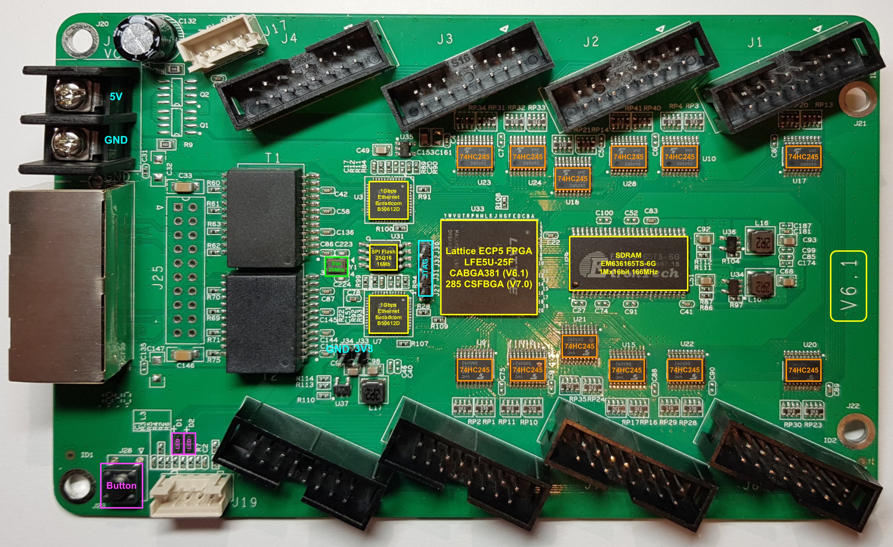
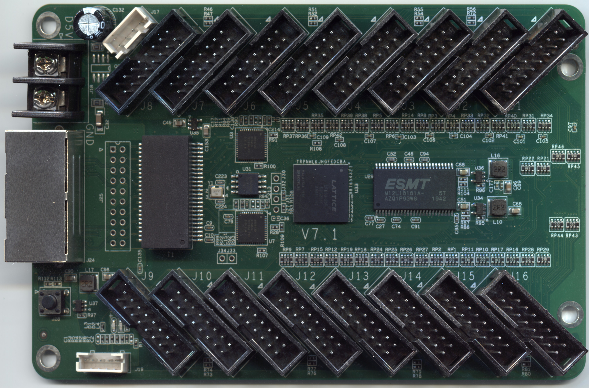

RV901T and ColorLight 5A-75B LED Receiver Cards
===============================================

This repository contains reverse engineering information about the following boards:

* Linsn RV901T HUB75 LED driver card (which uses a Spartan 6 LX16 FPGA)
* ColorLight 5A-75B V6.1 and V7.0 (which use a Lattice ECP5-25 FPGA)

These are known as a "Receiver Card". Its stock function is to receive and forward framebuffer 
data using a proprietary protocol (from a "Sender Card") and blit out control signals to LED panels 
(via shields, like a HUB75 shield).

**Chubby75** is a project to reverse engineer, document and provide tools for these cards. 

Colorlight 5A-75B
------------------

This is a very interesting card because bitstreams for its Lattice ECP5-25 FPGA can be generated
entirely with an open source tool chain (Yosys for synthesis, NextPNR for Place & Route, Project
Trellis for bitstream handling.)
This board is supported by the visual editor for open FPGA boards [IceStudio](https://icestudio.io/) thanks to [benitoss](https://github.com/benitoss).

You can find information about it [here](./5a-75b/README.md).

Colorlight 5A-75E
------------------

This board is almost identical to Colorlight 5A-75B, but has twice as many HUB75 ports.
This board is supported by the visual editor for open FPGA boards [IceStudio](https://icestudio.io/) thanks to [benitoss](https://github.com/benitoss).

You can find information about it [here](./5a-75e/README.md).

RV901T LED
----------

You can find information about it [here](./rv901t/README.md).

As it contains a user-reprogrammable Spartan 6 FPGA (LX16, 14k 'logic cells', 9112 LUTs) and 2x GbE, it has 
potential to be usable as a general purpose FPGA development board, an interface card for various purposes, 
or a logic analyzer.

RV908 - No Supported
--------------------

There are RV908 boards which are an RV901T with the HUB75 daughter board integrated.

At least 2 versions are known to exist: RV908M32 and RV908T. The RV908T is likely a cost 
reduction of the RV908M32.

The RV908M32 has JTAG testpoints that are similar to the RV901T (which requires some scraping of silk
screen and soldering work to get access.) The RV908T has no known JTAG testpoints at all.

See [issue #20](https://github.com/q3k/chubby75/issues/20) for some discussion about these 2 boards.

It's hard to distinguish between the 2 boards or even specify with one to buy, so no further effort has been
made to document reverse engineering details in this project.

License
-------

[CC0](http://creativecommons.org/publicdomain/zero/1.0/") - to the extent possible under law, the person who associated CC0 with this 
work has waived all copyright and related or neighboring rights to this work.

