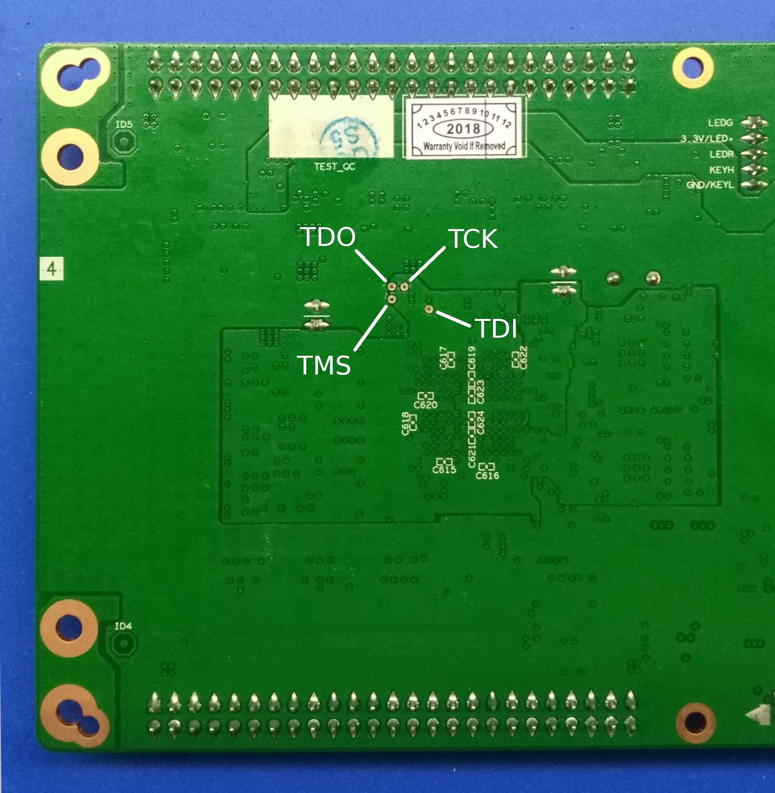
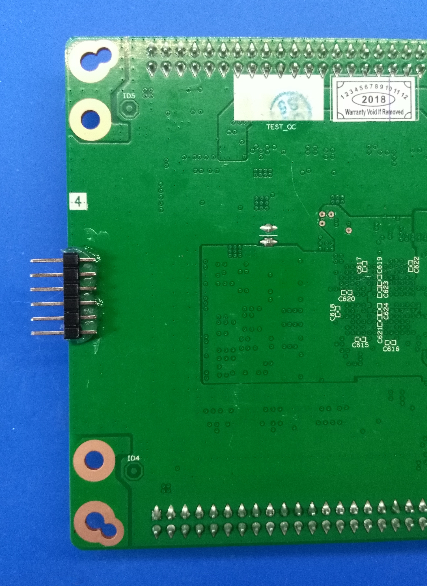
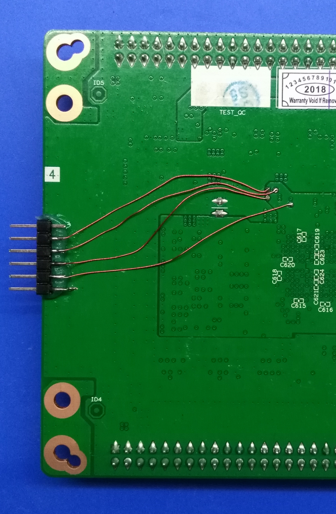
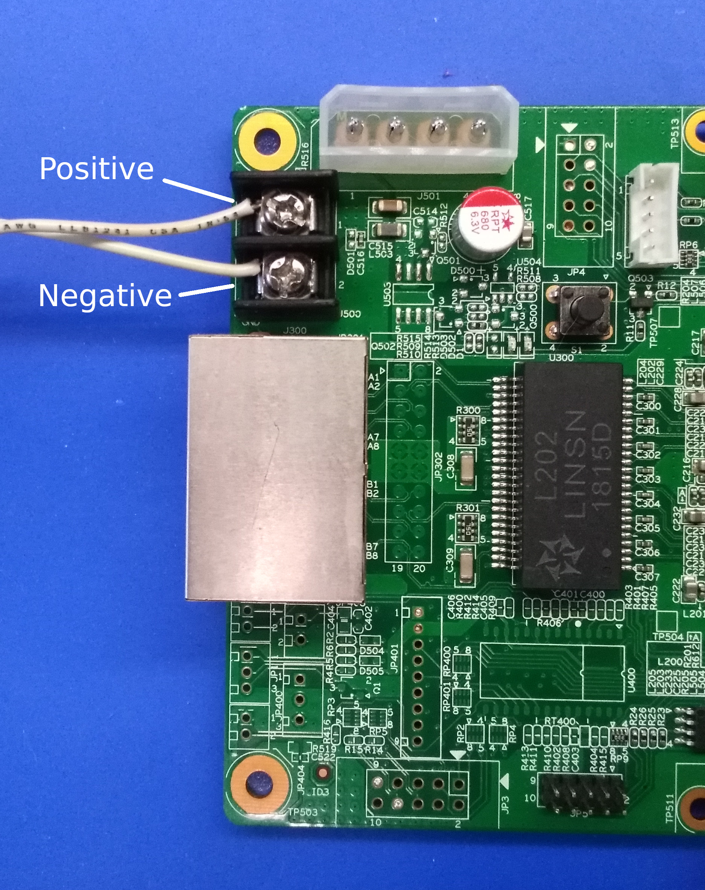
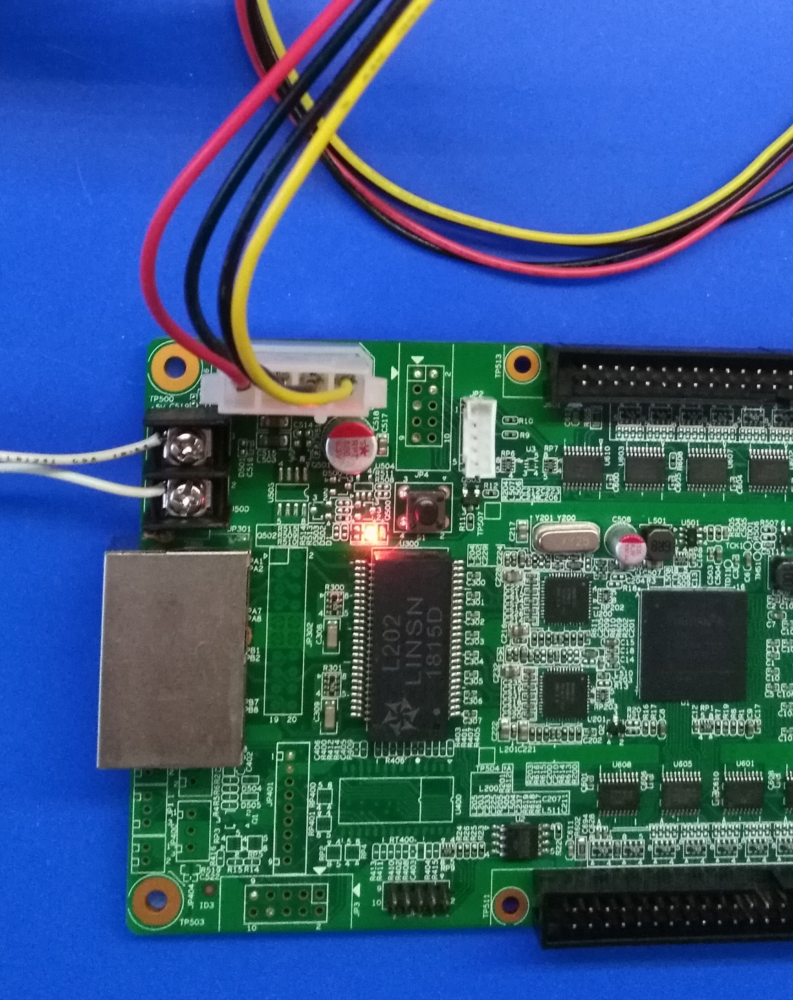
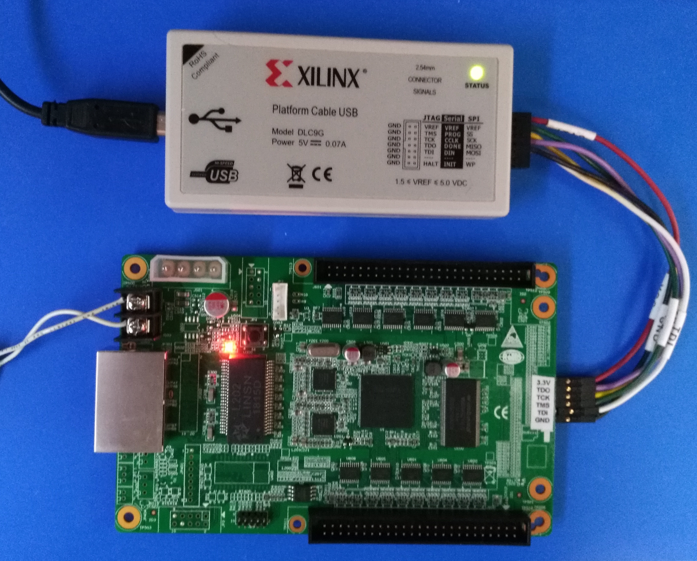
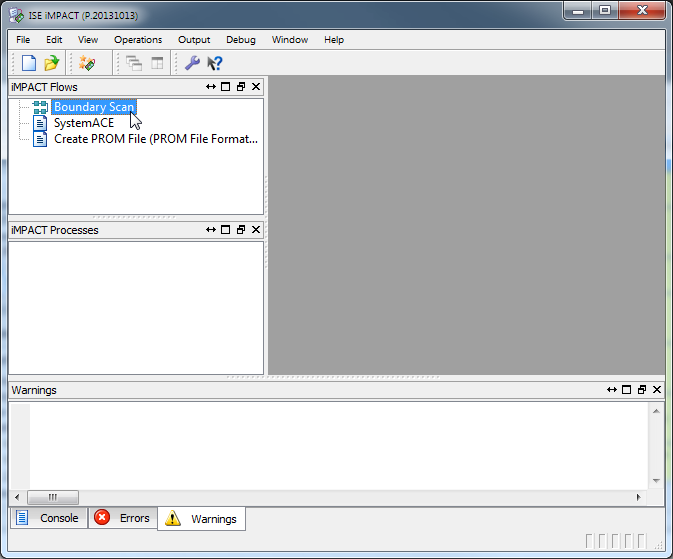

# Getting Started With the RV901T Board

The RV901T is a controller board for LED displays, but it's also suitable
for use as an FPGA development board since it has the following:

* Spartan-6 FPGA (XC6LX16),
* Serial flash,
* 64 MBytes of SDRAM,
* Two Gb Ethernet PHYs,
* 25 MHz oscillator,
* Numerous 5V I/O ports,
* A single pushbutton,
* A single LED.

You can find out more about the RV901T at https://github.com/q3k/chubby75
where a group of people are reverse-engineering the board.

This document will provide the information you need to set up the board
for doing FPGA development.

## Getting Access to the FPGA JTAG pins

During development, bitstreams are often downloaded into the FPGA through its JTAG port.
However, the RV901T does not appear to have a physical JTAG port for
attaching a downloading cable, so you'll have to physically modify the board.

The FPGA JTAG pins are brought out to test points on the PCB:

These test points are also available on the back of the PCB.
Unfortunately, they're covered with soldermask.
Using a fine knife-point, you can scrape off the mask and expose the 
test points as shown below:

Then, glue a 6x1 header to the board:

and connect the exposed test points to the header pins:

Also, scrape off a bit of solder mask to expose the PCB ground plane and
solder that to a header pin through a short piece of wire:

In addition, your downloading cable may require a reference voltage for the
JTAG pins. You can expose a small bit of the 3.3V power plane and connect that
to a header pin like so:

Once that's done, it's a good idea to label the header pins:

## Applying Power

The board can get power through the screw terminals:

or from a PC power supply through the Molex 8981 connector:

Once power is applied, a red LED will come on.
The nearby pushbutton `S1` will make a green LED turn on and off
as the button is pressed and released.

## Testing the JTAG Connection

Attach the downloading cable to the 6x1 header (in my case, I'm using a XILINX Platform Cable):

Then apply power to the RV901T board.
The `STATUS` LED on the Platform Cable should turn green.

Next, open XILINX ISE (that's the last version of the free XILINX tools
that supports the Spartan-6 FPGAs) and start the `iMPACT` tool:

In the `iMPACT` window, double-click the `Boundary Scan` flow:

Then, right-click in the `Boundary Scan` tab and select `Initialize Chain`:

If all goes well, iMPACT should detect the Spartan-6 LX16 FPGA attached to the JTAG header:

## Next Steps

At this point, you have an RV901T modified for use as a 
general-purpose FPGA development board.
You can create designs using the pin assignments listed [here](https://github.com/q3k/chubby75/blob/master/doc/hardware.md)
and download the compiled bitstreams to the FPGA through the JTAG port.
