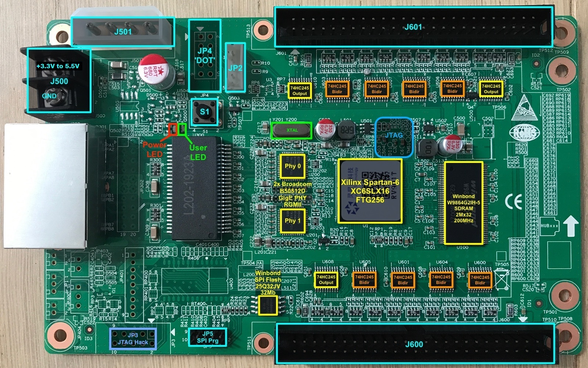

RV901T Receiver Card
====================

The Linsn RV901T HUB75 LED driver card has a Spartan 6 LX16 FPGA.

The Linsn RV901T contains a user-reprogrammable Spartan 6 FPGA (LX16, 14k 'logic cells', 9112 LUTs) and 2x GbE, it has 
potential to be usable as a general purpose FPGA development board, an interface card for various purposes, 
or a logic analyzer.

Documentation
-------------

* [Reverse engineered RV901T Hardware Documentation](./doc/hardware.md)
* [Reverse engineered HUB75B Hat Hardware Documentation](./doc/hub75b_hat.md)
* [Reverse engineered HUB7EB Hat Hardware Documentation](./doc/hub75e_hat.md)
* [Getting Started with the RV901T Board: JTAG Connector and LED blink](./doc/getting_started/getting_started.md)
* [Getting Started with the RV901T Board: Improved JTAG Connector and LED blink](./doc/getting_started/improved_jtag_getting_started.md)
(recomended)

The Improved JTAG Connector uses the JP3 header in a different purpose than
originally planned and provide a stable and solid connection for the JTAG cable.
Also, it require less skills to solder, as long the ground connection is
alredy available in the connector.

Hardware
--------

There is [hardware documentation](./doc/hardware.md) available, which includes WIP information about mapping from the FPGA balls / IO 
into various peripherals on board and connectors.

You can buy these boards from eBay, Aliexpress, Taobao. As of today (2019/01/26), these boards are around €18 
(including S&H) on Aliexpress.

Status
------

 - Hardware RE:
   - [X] Clocking
   - [X] LED and Button
   - [X] PHY0
   - [ ] PHY1 - *partially*
   - [X] J600
   - [X] J601
   - [ ] JP5 - SPI flash connector?
   - [X] JP4
   - [X] JP3 - Improved JTAG Connector
   - [ ] JP2
   - [X] U100 - SDRAM
 - Migen integration:
   - [X] Platform Defintion (`platform.py`)
 - LiteX integration
   - [X] Sample project (`sdram_test.py`)
 - LiteEth integration:
   - [X] Sample project (`rgmii_test.py`)

Acknowledgments
---------------

Thanks to Niklas Fauth and Jan Henrik for donating two boards and partially tracing out the PHYs, and delayering the PCB.

Thanks to carrotIndustries for assisting with the preliminary RE process at Glühweinprogrammiernacht 2018.

Thanks to enjoy-digital for reverse engineering the RGMII interface, implementing an S6 RGMII PHY interface, and the sample target files.

Thanks to jeanthom for reverse engineering the SDRAM interface.

Thanks for informatic for reverse engineering the HUB75B hat.

License
-------

[CC0](http://creativecommons.org/publicdomain/zero/1.0/") - to the extent possible under law, the person who associated CC0 with this 
work has waived all copyright and related or neighboring rights to this work.

